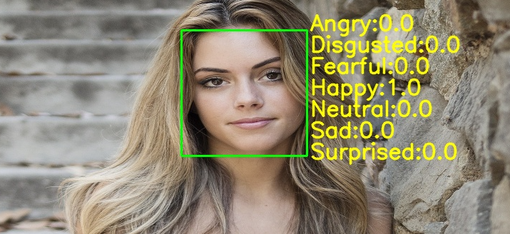

베이스라인 코드  
https://www.youtube.com/watch?v=UHdrxHPRBng

FER2013 Dataset  
https://www.kaggle.com/datasets/msambare/fer2013

### Face Emotions Recognition
#####before

####after


### 프로젝트 구조
ㄴdataset: FER2013 Dataset, gitignore 등록되어 있음. 위 링크를 통해 직접 설치  
ㄴhaarcascades: 하르캐스케이드, 얼굴 탐지 객체  
ㄴmodel: 학습된 DNN 모델  
ㄴtemplates: flask server가 제공하는 정적파일  
ㄴtestdata: test-img파일에서 참조하는 테스트 이미지  
FlaskSever.py: 플라스크 서버  
test-img.py: 학습된 모델을 이용하여 얼굴 감정 인식 테스트  
train.py: 모델 학습

### 의존성 정리  
```text
flask, flask_cors
```